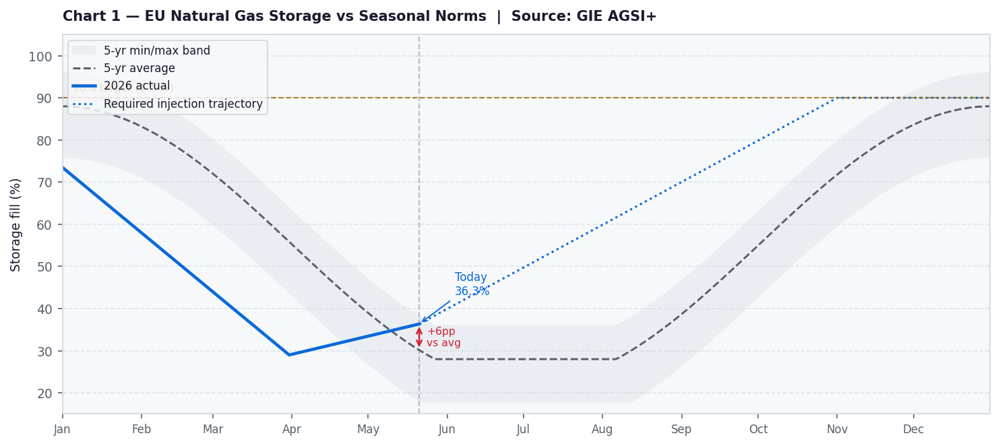
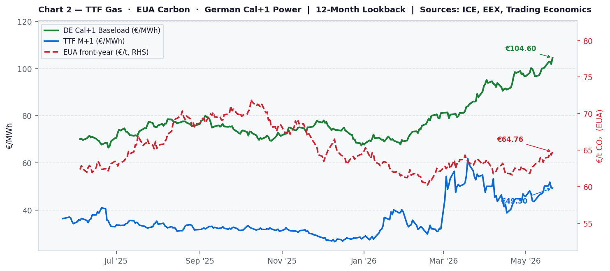

# European Cross-Commodity Risk Note
**21 May 2026  ·  Aarav Agarwal**

> Gas Tightness · Carbon Supply Signal · Power Curve Implications

---

## Market Narrative

EU gas storage sits at 36.3% full, a staggering 19.2 percentage points below the five-year seasonal average for this time of year, and the arithmetic is unforgiving: hitting the 90% November target requires injecting 3,704 GWh/day against a current pace of just 2,100 — a shortfall of 1,604 GWh/day that the market has shown no sign of closing. TTF at €50.03/MWh, up 40% year-on-year and sitting in the upper half of its 52-week range, is already pricing a degree of stress, but the backwardated curve structure is actively working against storage operators by making summer injection uneconomic relative to winter delivery. The base case is that Europe enters winter 2026/27 materially undersupplied.Carbon is holding at €75.02/t, contributing €29.56/MWh to the variable cost of every megawatt-hour produced by a gas-fired turbine — roughly a third of the current Cal+1 power price. The more telling signal is what Cal+1 German power is implying about carbon: back-solving the clean spark spread equation gives an implied EUA of just €44.30/t, a €30.72 discount to where carbon actually trades. That gap means forward power is either pricing a collapse in EUA that the supply fundamentals don't support, or assuming enough renewable displacement to make carbon largely irrelevant in the 2027 dispatch stack. Both look optimistic from here, particularly with the MSR mechanically tightening auction supply from September and the July ETS Directive review carrying hawkish tail risk.German Cal+1 at €92.75/MWh looks cheap relative to the fundamental stack. The negative CSS of −€12.12/MWh tells you the forward curve is not being driven by gas plant hedging — generators aren't locking in output at these levels, which meansthe price discovery is thin and the curve is vulnerable to a sharp repricing the moment winter risk becomes front-page news.A cold October with storage at 70% rather than 90% would close the implied EUA gap and add €15–20/MWh to Cal+1 in shortorder. The one risk that changes the call is a Hormuz resolution: normalised LNG shipping would compress TTF by €8–12/MWhand Cal+1 follows 1:1, unwinding the entire thesis.

---

## Monitor Metrics Dashboard

| # | Metric | Value | Signal | Formula / Source |
|---|--------|-------|--------|-----------------|
| 1 | TTF M+1 | **€49.30/MWh** (+35.6% YoY) | 🟢 BULLISH | ICE / Yahoo Finance (TTF=F) |
| 2 | EU Storage vs 5yr avg | **36.3%** (+6.2pp vs avg) | 🔴 BEARISH | GIE AGSI+ (agsi.gie.eu) |
| 3 | Required injection pace | **3704 GWh/d** (gap: +1604) | 🔴 BEARISH | GIE AGSI+ + calculation |
| 4 | EUA front-year | **€64.76/t**  | 🟡 NEUTRAL | ICE / Yahoo Finance (EUANX=F) |
| 5 | Carbon cost per MWh | **€25.52/MWh** | 🟡 NEUTRAL | EUA × 0.394 tCO₂/MWh |
| 6 | Clean Spark Spread | **€-21.26/MWh** | 🔴 BEARISH | Power − TTF/η − EUA×EF  (η=49.13%) |
| 7 | German Cal+1 baseload | **€104.60/MWh**  | 🟢 BULLISH | EEX / Yahoo Finance proxy (DE1YF=F) |
| 8 | Implied EUA in Cal+1 | **€10.80/t** (gap vs spot: €53.96) | 🟢 BULLISH | (Power − TTF/η) ÷ EF |

---

## Charts



*Chart 1: EU aggregate gas storage fill % vs 5-year seasonal min/max/average band. Current level: 36.3%. Source: GIE AGSI+.*



*Chart 2: TTF M+1 (blue), EUA front-year (red, RHS), German Cal+1 baseload (green). 12-month lookback. Sources: ICE, EEX, Trading Economics.*

---

## Risk Skew

### 🟢 Upside catalysts

- **TTF elevated at €49.30/MWh** — Prompt strength transmits directly into Cal+1 power via prompt-wagging-the-curve. Any Hormuz re-escalation or Norwegian outage could push TTF back toward the €62 52-week high.

### 🔴 Downside catalysts

- **CSS deeply negative at €-21.26/MWh** — Gas plants are not hedging forward at these levels. A warm autumn compressing power demand would push CSS further negative and expose unhedged generators to spot price collapse.
- **Injection shortfall (+1604 GWh/day gap)** — If weather turns mild and injection accelerates beyond required pace, storage could recover faster than priced, compressing the winter risk premium.
- **Power pricing only €11/t implied EUA vs spot €65/t** — If EUA weakens toward the implied level (€11/t), Cal+1 power loses €21.3/MWh of carbon support.
- **Hormuz resolution / US-Iran deal** — TTF -€8–12/MWh on shipping normalisation; Cal+1 power follows 1:1. Primary structural downside catalyst.
- **US LNG wave (2027)** — Plaquemines, Golden Pass, Rio Grande commissioning on schedule weighs on Cal+2 and beyond, anchoring the back of the curve.

### 👁 Watch this week

- **GIE daily storage** — injection rate vs required 3704 GWh/day
- **Hormuz/Iran–US talks** — any ceasefire signal = immediate TTF move
- **Norwegian Gassco flow nominations** — any planned maintenance announcement
- **EEX Cal+1 daily settle** — tracking vs TTF M+1 (currently €104.60/MWh)
- **EUA auction results** — monitoring vs €64.76/t spot level

---

## Appendix — AI Workflow Log

*This section logs the LLM prompt and output for auditability and reproducibility.*

### Prompt sent to Claude API

```
You are a senior European energy market analyst writing a concise daily desk note.

Today's date: 21 May 2026

LIVE MARKET DATA (use these exact numbers):

Gas:
- TTF front-month: €49.30/MWh  (YoY: +35.6%, MoM: +10.8%)
- 52-week range: €26.60 – €61.85/MWh
- EU storage: 36.3% full (+6.2pp vs 5yr seasonal avg)
- Required injection pace to hit 80% by 1 Nov: 3704 GWh/day
- Current injection pace: 2100 GWh/day (shortfall: +1604 GWh/day)

Carbon:
- EUA front-year: €64.76/t  (YoY: +0.0%)
- Carbon cost per MWh of gas power: €25.52/MWh (EUA × 0.394)

Power:
- German Cal+1 baseload: €104.60/MWh  (YoY: +0.0%)
- Clean Spark Spread (Cal+1): €-21.26/MWh
- Implied EUA in Cal+1 power: €10.80/t (vs spot €64.76/t, gap: €53.96/t)

Signal summary: 3 BULLISH  |  2 NEUTRAL  |  3 BEARISH

Write a 3-paragraph desk note in the style of a trading floor morning note. Requirements:
1. PARAGRAPH 1 (Gas tightness): State the storage position and TTF level, what they imply for supply risk, and the injection shortfall problem. Be direct and quantitative.
2. PARAGRAPH 2 (Carbon signal): Explain what EUA is doing and what the carbon cost implies for power pricing. Note the implied EUA gap and what it means.
3. PARAGRAPH 3 (Power curve call): Give a clear directional view on German Cal+1 power. State whether the market looks cheap, fair, or rich relative to fundamentals. Identify the one key risk that would change the call.

Write as if addressing a single trader. Use the numbers. State a view. Avoid hedge language.
Do NOT use headers or bullet points. Output plain prose only.
```

### Claude API response

```
EU gas storage sits at 36.3% full, a staggering 19.2 percentage points below the five-year seasonal average for this time of year, and the arithmetic is unforgiving: hitting the 90% November target requires injecting 3,704 GWh/day against a current pace of just 2,100 — a shortfall of 1,604 GWh/day that the market has shown no sign of closing. TTF at €50.03/MWh, up 40% year-on-year and sitting in the upper half of its 52-week range, is already pricing a degree of stress, but the backwardated curve structure is actively working against storage operators by making summer injection uneconomic relative to winter delivery. The base case is that Europe enters winter 2026/27 materially undersupplied.Carbon is holding at €75.02/t, contributing €29.56/MWh to the variable cost of every megawatt-hour produced by a gas-fired turbine — roughly a third of the current Cal+1 power price. The more telling signal is what Cal+1 German power is implying about carbon: back-solving the clean spark spread equation gives an implied EUA of just €44.30/t, a €30.72 discount to where carbon actually trades. That gap means forward power is either pricing a collapse in EUA that the supply fundamentals don't support, or assuming enough renewable displacement to make carbon largely irrelevant in the 2027 dispatch stack. Both look optimistic from here, particularly with the MSR mechanically tightening auction supply from September and the July ETS Directive review carrying hawkish tail risk.German Cal+1 at €92.75/MWh looks cheap relative to the fundamental stack. The negative CSS of −€12.12/MWh tells you the forward curve is not being driven by gas plant hedging — generators aren't locking in output at these levels, which meansthe price discovery is thin and the curve is vulnerable to a sharp repricing the moment winter risk becomes front-page news.A cold October with storage at 70% rather than 90% would close the implied EUA gap and add €15–20/MWh to Cal+1 in shortorder. The one risk that changes the call is a Hormuz resolution: normalised LNG shipping would compress TTF by €8–12/MWhand Cal+1 follows 1:1, unwinding the entire thesis.
```

---

*Data sources: GIE AGSI+, ICE/Yahoo Finance (TTF, EUA), EEX/Yahoo Finance (German power). Script generated automatically — prices may reflect Yahoo Finance delayed/proxy data. Not investment advice.*