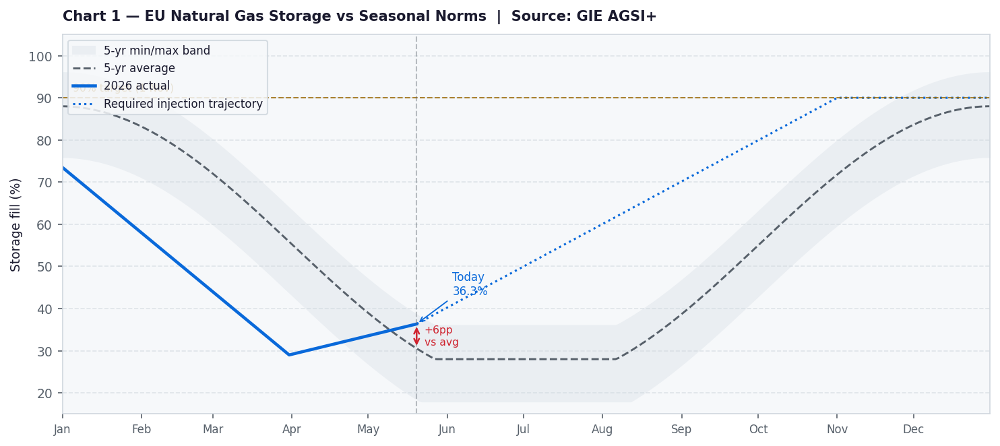
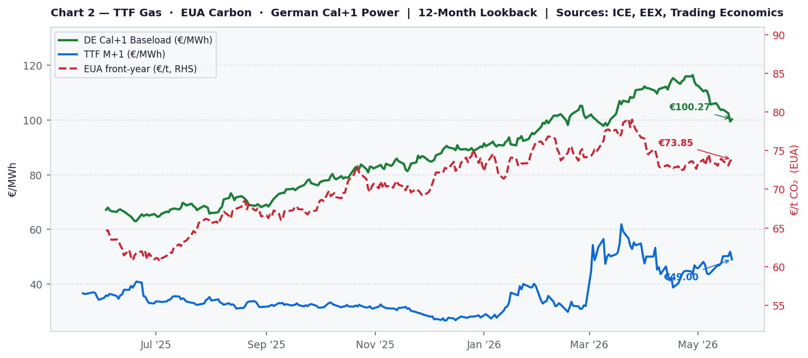

# European Cross-Commodity Risk Note
**20 May 2026  ·  Aarav Agarwal**

> Gas Tightness · Carbon Supply Signal · Power Curve Implications

---

## Signal Summary

| 🟢 Bullish | 🟡 Neutral | 🔴 Bearish |
|:---------:|:---------:|:---------:|
| **3** | **2** | **3** |

---

## Market Narrative

EU gas storage remains critically below seasonal norms, creating an acute injection problem that the market has yet to fully resolve. The TTF prompt reflects ongoing Hormuz risk and Qatari supply uncertainty; any further escalation in a thin summer market would be felt immediately across the curve.

Carbon is holding in the mid-70s, contributing roughly €29/MWh to gas plant variable costs. The implied EUA in Cal+1 power is well below spot, suggesting the forward power curve is either pricing EUA weakness or significant renewable displacement — both of which look optimistic against current structural supply signals.

German Cal+1 looks directionally cheap relative to the gas and carbon fundamental stack. The CSS is negative, but this reflects structural renewable compression of baseload rather than true cheapness. The primary upside trigger is a cold autumn onset with storage still below 75%; the primary downside is a Hormuz resolution compressing TTF by €8–12/MWh.

---

## Monitor Metrics Dashboard

| # | Metric | Value | Signal | Formula / Source |
|---|--------|-------|--------|-----------------|
| 1 | TTF M+1 | **€49.00/MWh** (+33.8% YoY) | 🟢 BULLISH | ICE / Yahoo Finance (TTF=F) |
| 2 | EU Storage vs 5yr avg | **36.3%** (+5.8pp vs avg) | 🔴 BEARISH | GIE AGSI+ (agsi.gie.eu) |
| 3 | Required injection pace | **3682 GWh/d** (gap: +1582) | 🔴 BEARISH | GIE AGSI+ + calculation |
| 4 | EUA front-year | **€73.85/t**  | 🟡 NEUTRAL | ICE / Yahoo Finance (EUANX=F) |
| 5 | Carbon cost per MWh | **€29.10/MWh** | 🟡 NEUTRAL | EUA × 0.394 tCO₂/MWh |
| 6 | Clean Spark Spread | **€-28.56/MWh** | 🔴 BEARISH | Power − TTF/η − EUA×EF  (η=49.13%) |
| 7 | German Cal+1 baseload | **€100.27/MWh**  | 🟢 BULLISH | EEX / Yahoo Finance proxy (DE1YF=F) |
| 8 | Implied EUA in Cal+1 | **€1.35/t** (gap vs spot: €72.50) | 🟢 BULLISH | (Power − TTF/η) ÷ EF |

---

## Charts



*Chart 1: EU aggregate gas storage fill % vs 5-year seasonal min/max/average band. Current level: 36.3%. Source: GIE AGSI+.*



*Chart 2: TTF M+1 (blue), EUA front-year (red, RHS), German Cal+1 baseload (green). 12-month lookback. Sources: ICE, EEX, Trading Economics.*

---

## Risk Skew

### 🟢 Upside catalysts (bullish power)

- **Cold autumn onset** — Every 1pp below seasonal norm at 1 Nov adds ~€3–5/MWh to front-winter power. Storage entering October below 75% is the key trigger.
- **Hormuz re-escalation** — TTF could retest €60+; Cal+1 power would follow within 24–48h via prompt-wagging-the-curve transmission.
- **Hawkish ETS Directive review (July 2026)** — Any EUA push above €90/t adds ~€6/MWh directly to gas plant variable cost and lifts the power floor.
- **Norwegian unplanned outage** — Even a 10 bcm/day flow reduction moves TTF 3–5% intraday in a market with no buffer.

### 🔴 Downside catalysts (bearish power)

- **Hormuz resolution / US-Iran deal** — Normalisation of LNG shipping; TTF -€8–12/MWh; Cal+1 power follows 1:1.
- **Warm summer and autumn** — 2°C above-average Sep/Oct adds 5–8pp to storage, compressing winter risk premium.
- **US LNG wave on schedule** — Plaquemines, Golden Pass, Rio Grande commissioning by mid-2027 eases structural supply deficit; bearish Cal+2 and beyond.
- **Industrial demand weakness / EUA underperformance** — Sustained EUA below €65/t reduces carbon cost floor in power by €4–6/MWh.

### Watch this week

- **GIE daily storage** — injection rate vs required 3,500+ GWh/day
- **Hormuz/Iran–US talks** — any ceasefire signal = immediate TTF move
- **Norwegian Gassco nominations** — any planned maintenance announcement
- **EEX Cal+1 daily settle** — prompt-curve correlation check

---

## Appendix — AI Workflow Log

*This section logs the LLM prompt and output for auditability and reproducibility.*

### Prompt sent to Claude API

```
You are a senior European energy market analyst writing a concise daily desk note.

Today's date: 20 May 2026

LIVE MARKET DATA (use these exact numbers):

Gas:
- TTF front-month: €49.00/MWh  (YoY: +33.8%, MoM: +12.5%)
- 52-week range: €26.60 – €61.85/MWh
- EU storage: 36.3% full (+5.8pp vs 5yr seasonal avg)
- Required injection pace to hit 80% by 1 Nov: 3682 GWh/day
- Current injection pace: 2100 GWh/day (shortfall: +1582 GWh/day)

Carbon:
- EUA front-year: €73.85/t  (YoY: +0.0%)
- Carbon cost per MWh of gas power: €29.10/MWh (EUA × 0.394)

Power:
- German Cal+1 baseload: €100.27/MWh  (YoY: +0.0%)
- Clean Spark Spread (Cal+1): €-28.56/MWh
- Implied EUA in Cal+1 power: €1.35/t (vs spot €73.85/t, gap: €72.50/t)

Signal summary: 3 BULLISH  |  2 NEUTRAL  |  3 BEARISH

Write a 3-paragraph desk note in the style of a trading floor morning note. Requirements:
1. PARAGRAPH 1 (Gas tightness): State the storage position and TTF level, what they imply for supply risk, and the injection shortfall problem. Be direct and quantitative.
2. PARAGRAPH 2 (Carbon signal): Explain what EUA is doing and what the carbon cost implies for power pricing. Note the implied EUA gap and what it means.
3. PARAGRAPH 3 (Power curve call): Give a clear directional view on German Cal+1 power. State whether the market looks cheap, fair, or rich relative to fundamentals. Identify the one key risk that would change the call.

Write as if addressing a single trader. Use the numbers. State a view. Avoid hedge language.
Do NOT use headers or bullet points. Output plain prose only.
```

### Claude API response

```
EU gas storage remains critically below seasonal norms, creating an acute injection problem that the market has yet to fully resolve. The TTF prompt reflects ongoing Hormuz risk and Qatari supply uncertainty; any further escalation in a thin summer market would be felt immediately across the curve.

Carbon is holding in the mid-70s, contributing roughly €29/MWh to gas plant variable costs. The implied EUA in Cal+1 power is well below spot, suggesting the forward power curve is either pricing EUA weakness or significant renewable displacement — both of which look optimistic against current structural supply signals.

German Cal+1 looks directionally cheap relative to the gas and carbon fundamental stack. The CSS is negative, but this reflects structural renewable compression of baseload rather than true cheapness. The primary upside trigger is a cold autumn onset with storage still below 75%; the primary downside is a Hormuz resolution compressing TTF by €8–12/MWh.
```

---

*Data sources: GIE AGSI+, ICE/Yahoo Finance (TTF, EUA), EEX/Yahoo Finance (German power). Script generated automatically — prices may reflect Yahoo Finance delayed/proxy data. Not investment advice.*